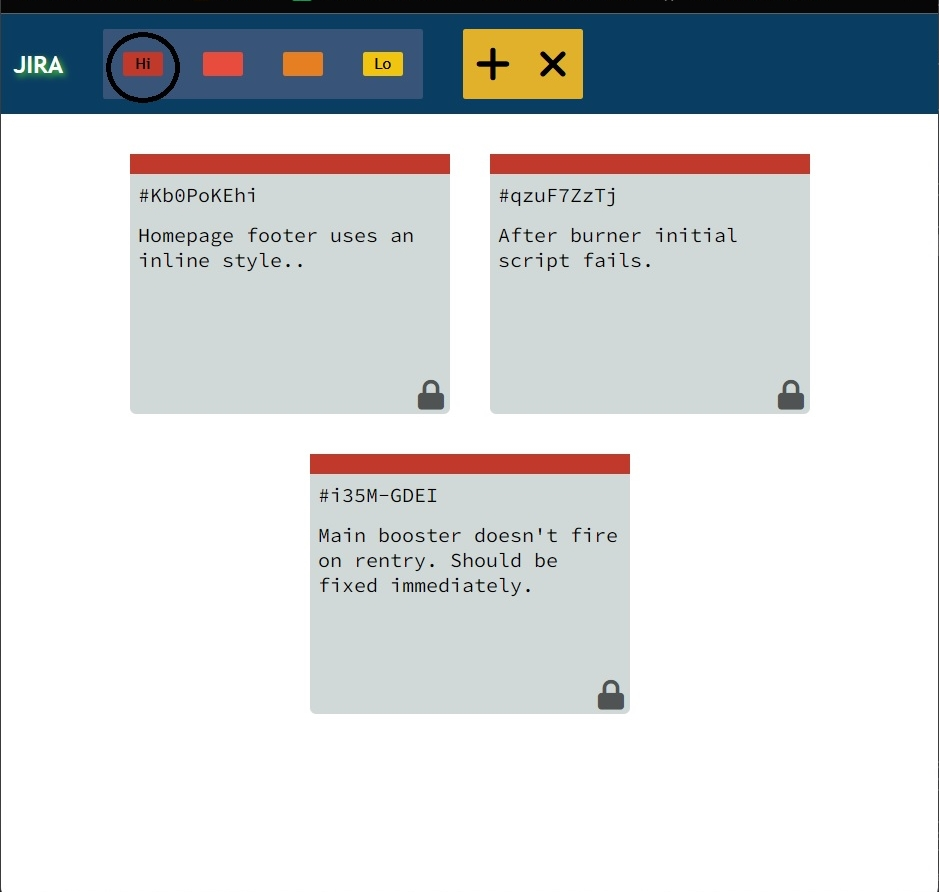

## JIRA Ticket Managemant 💥
- This is a clone of JIRA Software which is widely used in industry.
- Jira is a proprietary issue tracking product developed by Atlassian that allows bug tracking and agile project management.
--------
### Overview 🧩🧩
- I have provided add and remove buttons for the tickets, also tickets can be edited after they are generated.
- The generated tickets and color coded, and the colors can be provided according to the priority of that particular ticket.
- The toolbox on the top is also clickable, on which you can select a particular priority color to see the tickets of that priority.
--------
### Preview 📌📌

--------

